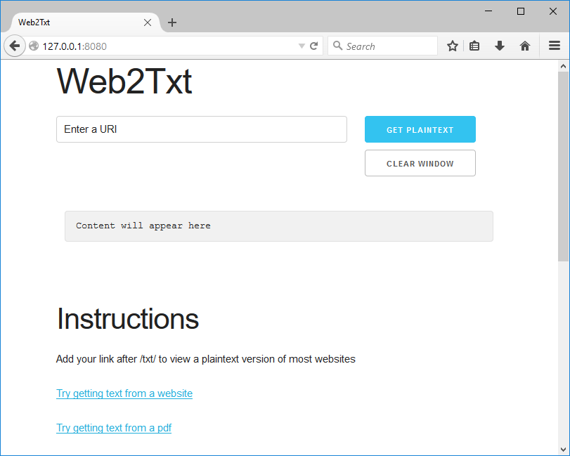
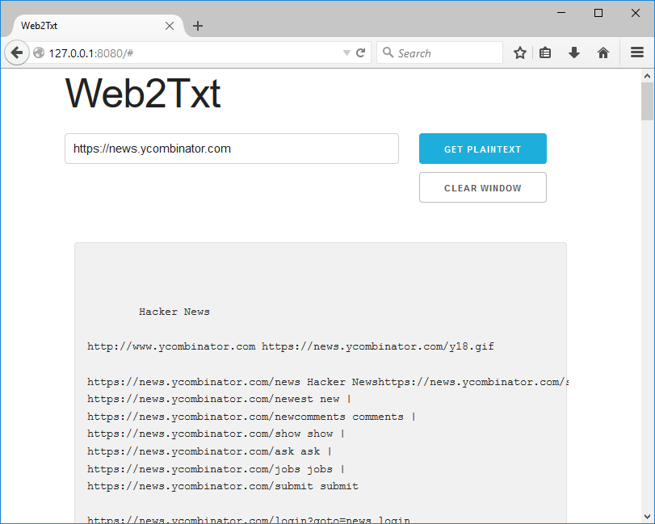
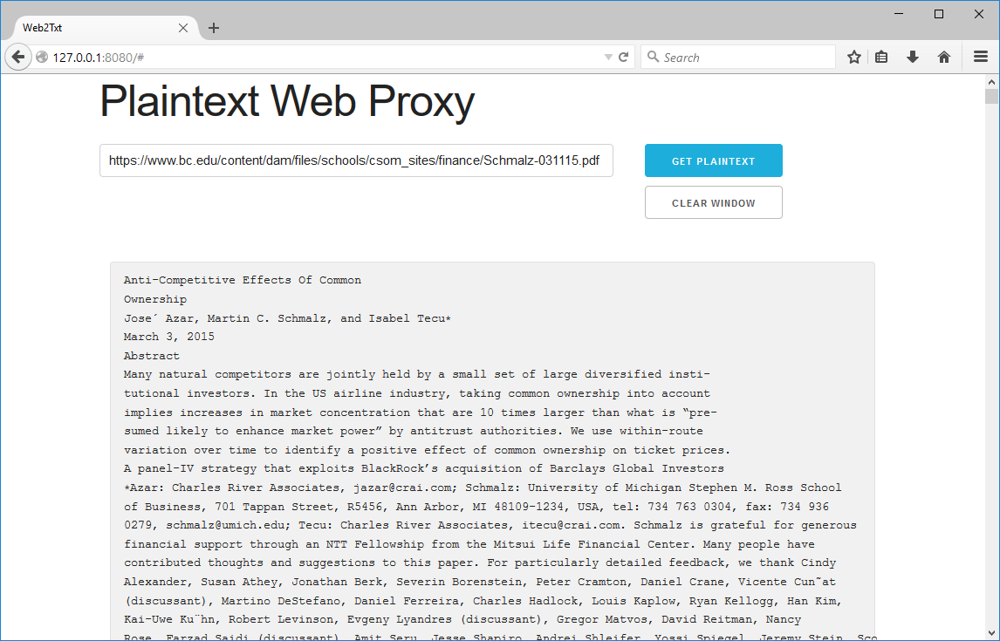

## Description

Web2Txt is a web application that allows users to retrieve plain text from the contents of a given URI.
It can extract plain text from html and pdf. For html, it removes script and style tags and makes links visible.
web2txt is written in Scala and also serves as an example of how to use the spray-routing and spray-client libraries.

## Motivation

Security and usability are the two major motivations for web2txt.
While browsers already provide a way to view web pages without javascript, cookies, and plugins, their ability to
safely render pdf files is suspect.
This application uses Apache PDFBox to extract only the safe and mobile friendly text content from pdf files.
Reading pdfs through web2txt rather than via a browser or proprietary pdf reader provides a greatly reduced attack surface.
For maximum security web2txt should be hosted on a remote VM.

## Screenshots

## Features

  * Retrieves html as txt
  * Retrieves html source as txt
  * Retrieves pdf as txt
  * Demonstrates cookie validation redirect chain
  * Strips tags from html
  * Low memory usage - only a single java.nio.CharBuffer per request
  * Demonstrates use of Apache PDFBox

## Spray Features Used

  * Implements custom spray-client pipelining to follow redirect chains
  * Implements spray-httpx custom Unmarshaller
  * Uses spray-routing directive to validate or reject requests based on cookie contents and return a "cookies required" page
  * Demonstrates use of spray-client
  * Demonstrates management of HttpHeaders and HttpCookies
  * Demonstrates use of dynamic route
  * Uses directive path matching to proxy requests
  * Retrieves static css and js assets from resources folder

## Installation

You must have sbt and the jdk installed.
It helps for the sbt bin directory to be included in your PATH environment variable.
Also, the JAVA_HOME environment variable must be set to the root directory of your JDK in order for sbt to work.
After using git to clone the repository, starting the application is easy.
In your console execute "sbt run" and the application will start and bind to localhost:8080.

## Notes

To change the bind address and/or port, you'll need to edit Main.scala.
If you're still using localhost and using Chrome and want to use cookies, you may need to add an alias to your hosts file.
You can add "127.0.0.1 localhost.net" and use localhost.net instead of localhost.
This is needed because the lack of extension on "localhost" indicates top level domain status to Chrome, and Chrome won't set cookies for top level domains.

## License

This project uses the Apache 2.0 license. Read LICENSE file.

## Authors and Copyright

Copyright (C) 2015 Jason Mar
